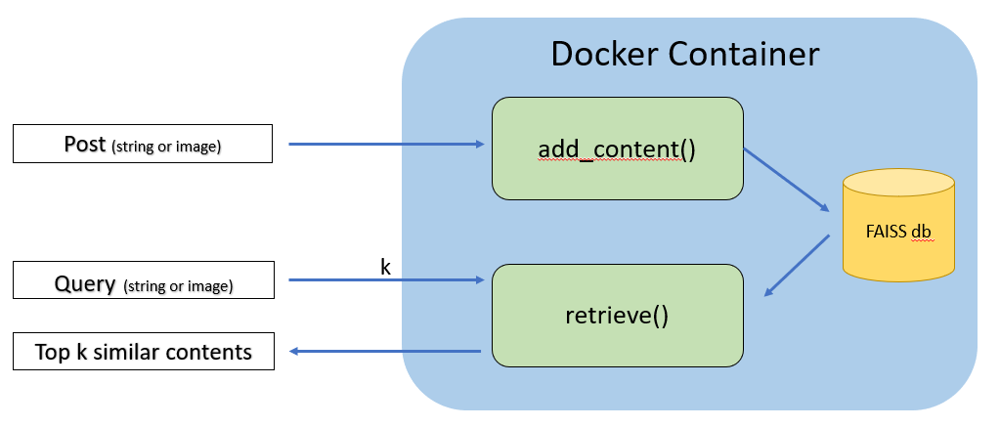

[[CLIP]](https://github.com/openai/CLIP) [[FAISS]](https://github.com/facebookresearch/faiss)

This application exposes a REST service to make content retrieval (through a search query, text or image) or content recommendation based on hystorical contents precedently updated by the user.
The service makes use of a pretrained **CLIP** model with:
- Vit-B/32 as vision encoder (512 embeddings dimension, 224 input resolution, 12 layers, 12 heads)
- BERT as text encoder (63M-parameter 12- layer 512-wide model with 8 attention heads).

Contents are indexed and searched in the application node by means of **faiss** library which speed up similarity search over the representational space.

## Retrieval


The user can access the system by means of two functions:
- **add_content()**: in this way the user can add a content (text or image) to the system. It will be encoded to a 512 embedding vector and stored into the Faiss index. 
    - Input:
        - username: unique identifier of the user who post the content;
        - text or image binary data (refer to usage.py example);
        - id: Mediaverse ID of the content to load;
        - type: "text" or "image", string describing the data type of the content to be loaded.
    - Output:
        - a success message in the field 'msg'
        - the elapsed time for the operation in the field 'time'

- **retrieve()**: the user enters a query (text or image) with the aim of retrieving as a result the k elements most similar, to the submitted 
query, among those stored inside the Faiss index. The top K contents are ranked according to the cosine similarity with respect to the input query. 
    - Input:
        - username: unique identifier of the user who search for a content;
        - text or image binary data (refer to usage.py example);
        - k: number of similar content to retrieve;
        - type: "text" or "imege", string describing the data type of the input query.
    - Output:
        - recommended texts in the field 'text':
            - 'contents' is an ordered list containing the ids (string) of the retrieved texts. The list is ordered based on decreasing values of similarity scores (i.e., the first content is the best one retrieved (among all texts) for that query)
            - 'scores' is an ordered list of similarity scores for the retrieved texts (i.e., the first score represents the similarity between the query and the first content in the 'contents' field).
        - recommended images in the field 'image':
            - 'contents' is an ordered list containing the ids (string) of the retrieved images. The list is ordered based on decreasing values of similarity scores (i.e., the first content is the best one retrieved (among all images) for that query)
            - 'scores' is an ordered list of similarity scores for the retrieved images (i.e., the first score represents the similarity between the query and the first content in the 'contents' field).
        
#### Retrieval output example
Given a query 'a page of text about segmentation' with k=4, the retrieve() fuction returns: 
```
[RETRIEVE]-- status: 200, b'{"image":{"contents":["4AYKRJ8QFS","HANEP78MN0","VJNL2OH70S","UVL3UWLG6Y"],"scores":[0.3587474226951599,0.22719718515872955,0.22674132883548737,0.22545325756072998]},"text":{"contents":["QICQ8T7NF9","TFGZJJ6UPX","FS5EI089C9","BGDTOVNTL5"],"scores":[0.6652600765228271,0.6554150581359863,0.619107723236084,0.6146003603935242]}}\n'
```

## Expose the service
#### 1. Manual setup

```
conda create --name mediaverse_rest python=3.8
conda activate mediaverse_rest
conda install -c pytorch faiss-cpu
pip install -r requirements.txt
flask run --port <PORT>
```

#### 2. Run a Docker container

```
docker build -t flask-restapi .
docker tag flask-restapi mediaverse/flask-restapi
docker rmi flask-restapi

docker run -d --network host --name mediaverse_rest mediaverse/flask-restapi

docker ps
docker stop mediaverse_rest
docker rm mediaverse_rest
docker rmi mediaverse/flask-restapi
```

As the instrutions show it is suggested to run the application in the host network providing an available port (settable in the Dockerfile).